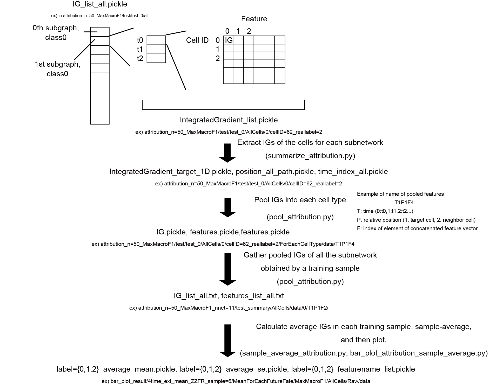
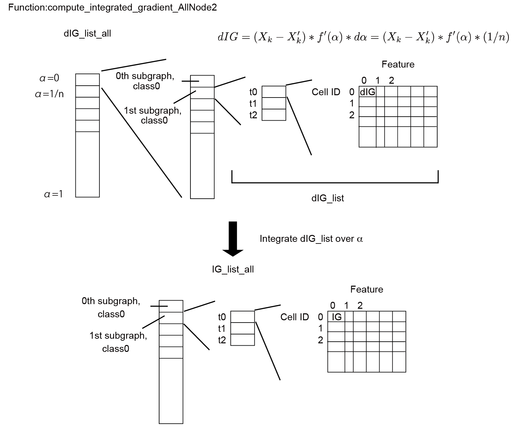

# Calculate the attribution: Integrated gradient(IG)

- calculate_attribution.py

Calculate integrated gradients (IGs) for each feature of each subgraph. 


## Usage 

Put `calculate_attribution_batch` in some directory, and then run `run_calculate_attribution.py` with 

`base_path_list.txt`: list of dirpath of samples. 

This code runs calculate_attribution.py for the samples listed in base_path_list.txt, and calculates attributions in parallel.

Here, we show the overview of the calculation of IG. The flow chart includes the processes peformed by codes in the following directories:

- `../calculate_attribution`
- `../softmax_to_pool_attribution`
- `../bar_plot_attribution`

   


## Details


### calculate_attribution.py 

- Input 
    - input_calculate_attribution.yml: conditions for calculation of the attributions.  

        ```yml
        n: 50   # number of discretization of f(\alpha)

        plot_option: 0 ## if 1 plot

        cell_select: "all" ## Set "all". "correct" for only correct cells, all for all the cells.

        ModelType: "MaxMacroF1"

        subnetwork_name: norm_all_1hot_rev
        ``` 
        
    - input_fig_config.yml: figure configurations 
      
  
- Output 

    Directory such as "attribution_n=50_MaxMacroF1" is created in each sample directory made when training and then the following data is saved. For example, attrubution of each graph is saved in "test_0". Here, test_0 means the 0th spatiotemporal graph of the training datathe above figure in "Overview of caluculating and plotting IG".  

    - test/test_0/all  

        Integrated gradients are calculated for all the output nodes in each spatio-temporal graph for each cell fate label, and are first output in this directory. The IG is calculated by the function `att_func.compute_integrated_gradient_AllNode2`.     
        
        output files:  
        - IG_list_all.pickle: list of IGs associated with each subnetowork. The data is saved as a list nested as shown in the above figure in "Overview of caluculating and plotting IG".

        - nodeID_list.pickle: Loaded from labels/test/test_data%d/cellID_target.txt"%i of the training directory. The cell IDs used for the test.

        - y_score_list_all.pickle: 
        
            softmax score $f(\alpha)$ for each subnetwork and each label is caclulated for each $\alpha=i/n\ (i=0\sim n)$, which is a variable of integral in IG calculation. The scores $f(\alpha)\ (\alpha=i/n\ (i=0\sim n))$ are saved as a list, and you can access $f(\alpha)$ as `y_score_list_all[node index,Label(0:NB,1:Del,2:Div),:]`.   


    - test/test_0/AllCells/0/cellID=62_reallabel=2  

        For example, this name of the directory corresponds to the cell with the cell ID=62 whose real label is 2. The IG and softmax scores for label 0 are listed for all the features of all the nodes for each label. These data are extracted from the IG_list_all.pickle and y_score_list_all.pickle as follows in the code.    

        ```python
        index =  Class*total_node_number + node_count
        y_score_list = y_score_list_all[node_count,Class,:]
        IntegratedGradient_list = IG_list_all[index]
        ```
                     
            
        Also for convenience in the further analysis, the information of the subgraph i.e. `AllTargetCellListNoDoubling_cellID=%d_t=%dto%d.pickle, AllNeighborCellList_cellID=%d_t=%dto%d.pickle and LineageList_cellID=%d_t=%dto%d.pickle` is copied from the data directory.  

   
        - AllNeighborCellList.pickle
        - AllTargetCellListNoDoubling.pickle
        - IntegratedGradient_list.pickle
        - LineageList.pickle
        - y_score_list.pickle
    
        We use this information for the further analysis of the attribution. 
        You can see the data formats by using `../softmax_to_pool_attribution/check_data_format.ipynb`.
    
    

## Overview of the function compute_integrated_gradient_AllNode2


We use graphs with nonisolated nodes for autograd, and then calculate the IG for the original graph.

Parameters: 

``` 
n: # of step for discritization of alpha ranging 0-1
existing_IDList: [[ID list of non-isolated cells at t0],[ID list of non-isolated cells at t1],,,]
input_original_exist: graph which the isolated nodes are removed. Node IDs are re-indexed by preserving the orders.
input_template_exist: graph which the isolated nodes are removed. Node IDs are re-indexed by preserving the orders.
input_blank_exist: input_original_exist with zero-valued features
input_original: original graph with isolated nodes
model:trained model
time_list: ["t0",,]
feature: feature name
new_index: index of the target cells in the final time frame, which is in original node ID list, in the non-isolated list. This is the new index of the target cells in input_original_exist.
nodeID_list: original node ID list
ClassList: [0,1,2]
```

- Overview of the data formats in the code in caluculating IGs


   
