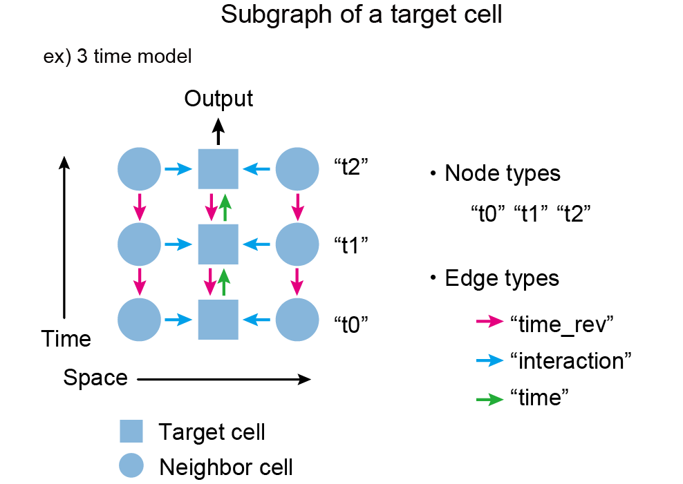

# Create network

Create spatiotemopral graphs with DGL format and save as pickle files. 

- create_network.py: create spatio-temporal graphs with DGL format.
- ReadNetworkEditFL.py: load created graphs and make the NFB feature one-hot vecotors.

## Usage 

Put create_network_batch in a directory and run run_create_network.py with .txt and .yml fiels to set the parameters.

This executes two codes above sequentially for multiple samples.

## Details

### create_network.py

Create spatio-temporal graphs with DGL format. 

Output example:

This program creates "{directory including the lineage and segmentation data}/analysis/networknorm_all_1hot_rev_crop_w=320_h=320" with the following sub-directories: 

 - networknorm_all_1hot_rev_cellID_FinalLayer_noborder_num_w=320_h=320_time=4

    - CellID_FinalLayer_t=0to3.txt...: list of cell IDs at the final layer of each spatiotemporal graph. The cells at the outmost layer are avoided. 
        
 - networknorm_all_1hot_rev_cellID_FinalLayer_num_w=320_h=320_time=4
    
    - CellID_FinalLayer_t=0to3.txt...: list of cell IDs at the final layer of each spatiotemporal graph. 
        
        
 - networknorm_all_1hot_rev_LineageType_w=320_h=320_time=4
 
    - LineageType_1.txt...: list of lineage types.
    
 - networknorm_all_1hot_rev_num_w=320_h=320_time=4
    
   - network_t=1to4.pickle: spatiotemporal graph without features.
   - NetworkWithFeartures_t=1to4.pickle: spatiotemporal graph with features.
        
 - networknorm_all_1hot_rev_tif_overlap_network_w=320_h=320/time4
 
   - tif_overlap_network_crop_w=320_h=320_3.png: segmentation image with the graph.
        
 - networknorm_all_1hot_rev_trackdata_crop_w=320_h=320
 
   - trackdata_crop_w=320_h=320_0.txt: track data only for the cropped region.
    


### ReadNetworkEditFL.py

This codes creates, for example, "{directory including the lineage and segmentation data}/analysis/networknorm_all_1hot_rev-FLedit_crop_w=320_h=320". 
Cell IDs at the final layer and the spatiotemporal graphs are output like create_network.py.

output example: 

  - networknorm_all_1hot_rev-FLedit_cellID_FinalLayer_noborder_num_w=320_h=320_time=4
  - networknorm_all_1hot_rev-FLedit_num_w=320_h=320_time=4
    

## Graph format

- Node type
    't0','t1','t2',,,: ex. 't0' means the cell type of the cells in the first time frame, 't1' means the cell type of the cells in the second time frame. 

- Edge type
    - temporal
        - "time" : edges in normal direction
        - "time_rev" : edges in time-reversal direction
    
    - spatial
        - "interaction"
        
   


- Node features

    - 'Area_norm': Nomalized area.

    - 'G1Signal_norm': Normalized G1 signal.

    - 'celltype_future_onehot2': Next frame behavior (NFB) represented by the one-hot vector.  

    
```
[1,0,0]: NB (No behavior), [0,1,0]: Del (Delamination), [0,0,1]: Div (Division)
```
        
        
## Parameters 

ex. 

```yml
network_name: "norm_all_1hot_rev"
time_min: 1 
time_max: 5
shuffle_switch: 0
```

You can sequentially create from {time_min}-time graphs to {time_max}-time graphs. 