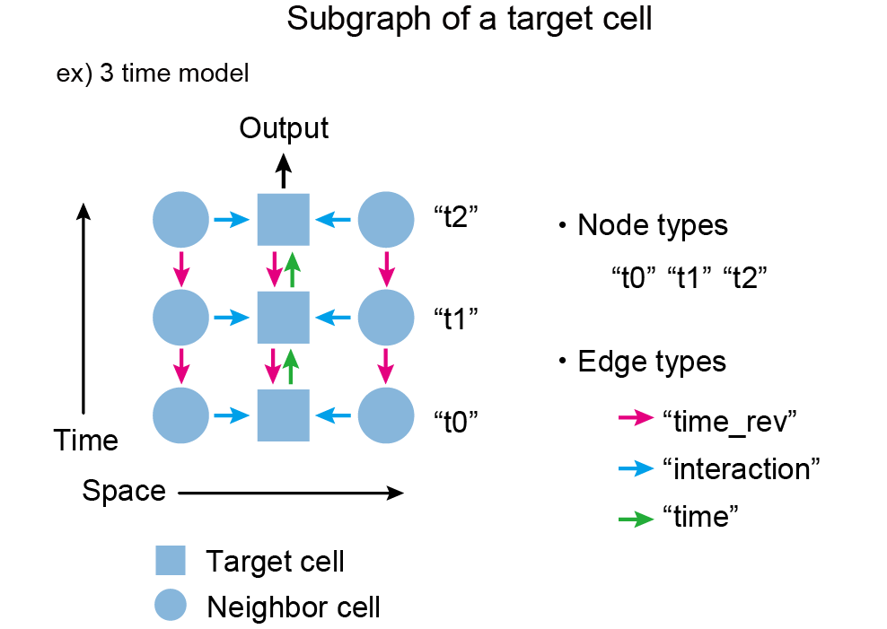

# Probing the rules of cell coordination in live tissues by interpretable machine learning based on graph neural networks

Codes used in the following paper:

Takaki Yamamoto, Katie Cockburn, Valentina Greco, Kyogo Kawaguchi

"Probing the rules of cell coordination in live tissues by interpretable machine learning based on graph neural networks"


## Abstract

Robustness in developing and homeostatic tissues is supported by various types of spatiotemporal cell-to-cell interactions. Although live imaging and cell tracking are powerful in providing direct evidence of cell coordination rules, extracting and comparing these rules across many tissues with potentially different length and timescales of coordination requires a versatile framework of analysis. Here we demonstrate that graph neural network (GNN) models are suited for this purpose, by showing how they can be applied to predict cell fate in tissues and utilized to infer the cell interactions governing the multicellular dynamics. Analyzing the live mammalian epidermis data, where spatiotemporal graphs constructed from cell tracks and cell contacts are given as inputs, GNN discovers distinct neighbor cell fate coordination rules that depend on the region of the body. This approach demonstrates how the GNN framework is powerful in inferring general cell interaction rules from live data without prior knowledge of the signaling involved. 

## Requirement


- pytorch 1.6.0
- python 3.7.7
- DGL (Deep Graph Library) 0.5.0
- numpy 1.18.5
- matplotlib 3.3.1
- sklern  0.23.2
- Docker

We used a Docker container installing by `docker pull pytorch:1.6.0-cuda10.1-cudnn7-runtime`

## GPU memory

1.2GB GPU memory is occupied for this demo program.

## Directory tree

```
.
├── data
│   └── simulation
│       └── del-div
│            └── sample0
│                └── cellIDs
│                └── graphs
│            └── sample1
│                └── cellIDs
│                └── graphs
│          
├── codes
│   ├── gnn_models_quick.py
│   ├── run_training_cell_fate_gnn.py
│   ├── input_run_training_cell_fate_gnn.yml
│   └── input_fig_config.yml
│
├─ functions_quick
│   ├── plot_module.py
│   └── system_utility.py
│
└── result (created by running model training program)

```


## DGL graphs
- Spatio-temporal graphs (DGL format) created from segmentation and trackdata

We used deep graph library (DGL) to make graph objects, and just saved them as .pickle. 

The node type is defined by the frame number of each cell in each graph. We name the node names as  “t0”,“t1",“t2”,,, from the earliest frame (see figure below).
There are three edge types:  “time”, “time_rev”, “interaction”. 
“time” is the temporal edge, representing lineage, directing from the past to future, while “time_rev” is the temporal edge directing from the future to the past. 
“interaction” edges are spatial edges between neighboring cells. Also, you need to define cell features as node features, ex. “celltype_future_onehot2"(NFB in our manuscript), “random_feature”, etc.

    - node type
        't0','t1','t2',,,: ex. 't0' means the cell type of the cells in the first time frame, 't1' means the cell type of the cells in the second time frame. 

    - edge type
        - temporal
            - "time" : edges in normal direction
            - "time_rev" : edges in time-reversal direction

        - spatial
            - "interaction"
            



In directory "graphs", we put the DGL spatio-temporal graphs (.pickle file). 
In each graph, the nodes are identified by the node ID and the node type. 
The node type is defined by the name of the time frame: "t0" for the first frame, "t1" for the second frames and so on. In this demo, the graphs are composed of 4 time frames (N<sub>t</sub> = 4). 

Features we used: 

- 'zero'

    You can set feature to zero by this. 

- 'celltype_future_onehot2'

    Next frame behavior (NFB) one-hot vector. 

    [1,0,0]: NB (No behavior), [0,1,0]: Del (Delamination), [0,0,1]: Div (Division)

    This feature is set to zero vector for the cells in the final layer of each graph. If you want to set zero onehot vector for all the nodes, set 'zero_celltype_future_onehot2'

- 'random_feature'

    Uniform random number ranging [0,1] is generated upon training.


For example, 

You can access the feature values of "Area_norm" in the first time frame "t0" as follows. 

```python
graph.nodes['t0'].data['celltype_future_onehot2']
```

Also, we have isolated nodes in the graphs, but ignore these nodes. These nodes were generated just for convenience when we created the graphs.

## Cell IDs in the final time frame of each graph

In directory "cellIDs", we list the node IDs in the final time frame of each graph. We predict the cell fate of these nodes. 


## Run training program

You can train the GNN model by running run_training_cell_fate_gnn.py. In this demo, we use "sample0" and "sample1", which are generated by numerical simulation (delamination-induced division), as training and test data, respectively. 

The result is saved in directory "result". 

- Parameters

Parameters should be written in input_run_training_cell_fate_gnn.yml as follows. 

```python 
dirpath_work: "../"  # dirpath of result. 

step_total: 100  # number of epoch
display_rate: 10 # rate of display of results (unit:epoch)
model_save_rate: 10 # rate of saving models (unit:epoch)

gpu: 1 # GPU number. you can check your available GPU by nvidia-smi -l. 

null_net: 1 # If 1, we introduce null graphs to train the model to satisfay the valid baselines for attribution. if 0, we don't introduce null graphs. def =1 

average_switch:  1 # if average 1, mean aggregation for spatial message passing. If 0, sum aggregation.

architecture:  "SP"   # SP: for unidirectional GNN model, NSP for bidirectional GNN model


n_layers: 1  # number of layers of a MLP
hid_node: 50  # number of nodes in the hidden layer

NoSelfInfo: 1 # if 0, full model. if 1, cell external model.

in_plane: 1  # number of in-plane message passing

p_hidden: 0.1   # dropout rate

num_time: 4  # number of time frames. N_t.

feature_list: 
    - 'zero'
    - 'zero'
    - 'celltype_future_onehot2'
    - 'random_feature'
    
opt_name: "adam"  ## name of optimizer. Use adam.
learning_rate: 0.0001   # learning rate

```

The features you use for the training are listed in "feature_list". 
In this test condition, you train cell external model with mean aggretation using NFB and random feature (Fig.4C in the main text). 


- Output

    - fig
    
        Balanced accuracy and loss curves.

    - ROC
    
        ROC curve.
    
    - model
    
        Models at each epoch. 
    - labels, log, network, features, parameters.pickle
        
        
## Reference

If this repository is helpful for your research, please cite the following publication:

Takaki Yamamoto, Katie Cockburn, Valentina Greco, Kyogo Kawaguchi

bioRxiv, 2021.06.23.449559 (2021).

https://www.biorxiv.org/content/10.1101/2021.06.23.449559v1
